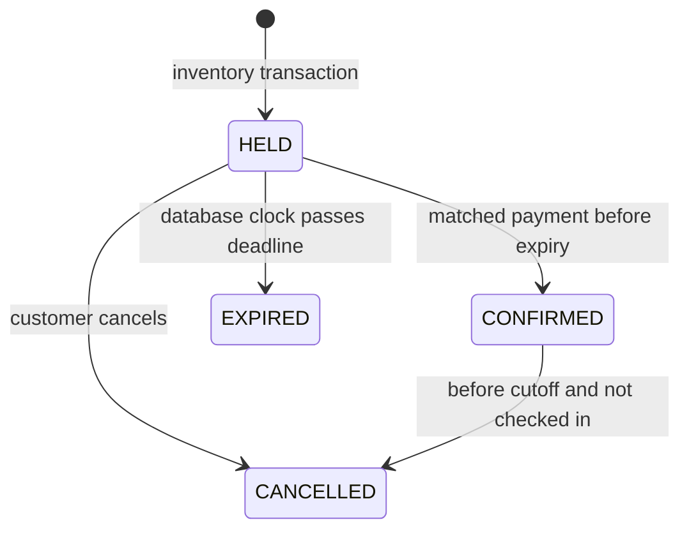

# Payment integration extension

Provider settlement adds an additive checkout table, immutable payment-provider binding, independent gateway validation, per-payment verification locks and bounded worker reconciliation. See [PAYMENT_DESIGN.md](PAYMENT_DESIGN.md) for current behavior, refund limits and API-contract validation status. The original demo architecture below remains the foundation; sandbox-only payment statements below describe the original version.

# Architecture and decisions

## Inventory invariant

For each event seat, at most one booking owns inventory. `seats.booking_id` is the current ownership pointer. `booking_items` is an immutable snapshot of seat labels/prices and may contain historical cancelled/expired bookings. Do not count historical booking items as current inventory.

Money is stored as integer paisa (BDT minor units); 75000 means BDT 750. Pricing is computed by the backend, never accepted from the customer. Payment amount and currency must match the stored intent.

## Reservation transaction

1. Validate a bounded, unique list of 1–6 seat UUIDs and an idempotency key.
2. Acquire a transaction advisory lock for `(user, key)`; a retry with another payload returns 409.
3. Acquire a transaction advisory lock for the event, using `hashtextextended(eventId, 0)`.
4. Release expired HELD bookings for that event using the database clock.
5. Reject nonexistent/started events, invalid seat IDs, a fourth active hold for that user/event, or owned inventory.
6. Lock requested seats in sorted UUID order and calculate server-side pricing.
7. Insert booking/items/idempotency/audit and update inventory in one transaction.
8. Commit before returning a hold. If any statement fails, the whole mutation rolls back.

All payment, cancellation, check-in and expiry paths acquire the same event advisory lock before mutating inventory. This deliberately serializes inventory mutations **within one event**. Separate events can proceed independently. Hash collisions may reduce concurrency, never permit double booking.

### Tradeoff: event locks

Seat-only locking has greater potential throughput but complicates the lock order across multi-seat holds, payment confirmation and expiry. Event locking is chosen here for a transparent, reviewable invariant. The included 100-request scenario tests contention correctness, not production scalability. To change this policy, define a deterministic seat/booking lock order, add native concurrent tests, measure p95/lock waits and compare designs. Do not swap in Redis locks as inventory authority.

Lock timeout is 5 seconds, statement timeout 10 seconds, pool size 20 by default. Busy lock/statement errors return 503 so callers can retry. Successful idempotent reservation retries return the same booking, even after expiry/cancellation; use a new key for a new intent.

## State transitions

Payment: CREATED → FAILED or SUCCEEDED; a delayed success can follow a failure notification. SUCCEEDED → REFUNDED only after a simulated refund completes. A FAILED event never downgrades SUCCEEDED/REFUNDED. Confirmed booking value in admin is not a reconciled revenue metric.

## Payment boundary

`POST /payments/webhook` verifies HMAC-SHA256 over `<unix-seconds>.<raw-body>` with a five-minute timestamp window and constant-time comparison. DTO validation rejects unknown/invalid fields. The global webhook event ID is unique; same payload retries are harmless; changed payload for the same ID is 409. Amount/currency mismatches fail before insertion.

A success is confirmed only if booking is still HELD, ownership count matches items, and `expires_at > clock_timestamp()` in the conditional UPDATE itself. If confirmation fails, expiration is rechecked and a unique refund is requested. Inventory is never reacquired after an old hold expires. Cancellation and success also share the event lock, so either ordering results in a consistent refund/booking state.

Sandbox-settle is authenticated, checks ownership and is unavailable when `ENABLE_SANDBOX=false`. It exercises the same domain method, but the sandbox button is not a provider SDK or a real charge. A live implementation must verify payment intent ownership at the provider, use provider idempotency keys, reconcile settlements and implement actual refund calls outside database transactions.

## Outbox and jobs

Business changes and outbox entries commit together. A two-second sweep publishes pending PostgreSQL outbox IDs to BullMQ using the UUID as the job ID. Redis AOF provides queue persistence; PostgreSQL retains intent if publishing fails or Redis data is lost.

Workers lock the outbox record and process it in a transaction. Notification IDs match outbox IDs. Refund uniqueness is enforced by `refunds.payment_id`. Repeated jobs do not duplicate database effects. The guarantee is **at-least-once job delivery with idempotent database effects**, not exactly-once distributed execution.

Retries: up to five failures with exponential backoff. Errors/attempts stay in PostgreSQL; admin retry resets pending task attempt metadata, and the dispatcher revives the failed job. No network provider call runs while an inventory lock is held. The refund handler only simulates completion when sandbox mode is enabled; otherwise it fails visibly without pretending to refund money.

## Auth and admission

Opaque 256-bit session tokens are hashed in PostgreSQL; passwords use scrypt with unique salts. Cookies are HttpOnly/SameSite=Strict, Secure when configured. Mutations require verified session, exact allowlisted Origin and session-bound CSRF header. Login/register have per-IP Redis limits; regular requests have per-cookie/IP limits. Redis unavailability fails closed for rate-limited routes. Request bodies/cookies/ticket tokens are omitted from logs.

Roles come from the database, never a client header. Customers access only their own bookings. ADMIN manages global demo operations. STAFF can check in only for explicitly assigned events. QR values are random 256-bit bearer admission tokens; scanners send tokens in POST bodies. Customer responses expose only their own ticket. Duplicate admission returns `alreadyCheckedIn=true` without another audit entry. A QR code is an image encoding, not an encryption layer.

## Why explicit SQL, not an ORM?

The hot path relies on row/advisory locks, conditional UPDATEs, `clock_timestamp()`, unique constraints and transaction-local timeouts. Parameterized `pg` statements make those boundaries visible. NestJS services still isolate HTTP from domain/persistence code. This is a deliberate engineering decision, not a claim that ORM tooling is unsuitable in general.

## Growth plan

Measure before adding components. Useful next measurements: reservation p50/p95/p99, pool saturation, lock waits, webhook latency, outbox age, error rate and refund reconciliation lag. Then consider per-seat lock redesign, read-only event caching with explicit invalidation, outbox batching, partitioning historical audit data and per-venue organizational access. CDN/image hosting, tracing, managed backups and provider adapters are separate increments.
